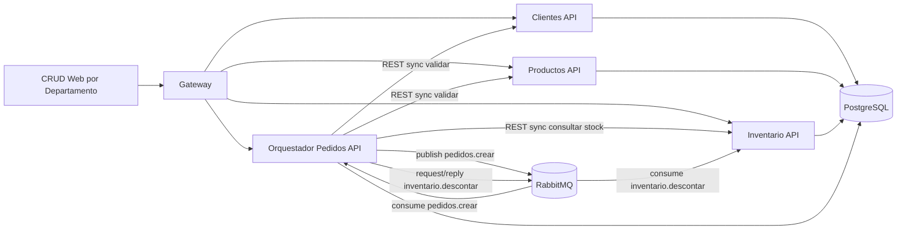

# Guia Final de Entregables - ShopNow

## 1) Repositorio de codigo (GitHub)
Checklist:
- [x] Microservicios FastAPI: `serv_clientes.py`, `serv_productos.py`, `serv_inventario.py`, `serv_pedidos.py`, `gateway.py`
- [x] Dockerfiles individuales:
  - `Dockerfile.clientes`
  - `Dockerfile.productos`
  - `Dockerfile.inventario`
  - `Dockerfile.pedidos`
  - `Dockerfile.gateway`
- [x] Archivo maestro de orquestacion:
  - `docker-compose.yml`
  - `compose.yaml`

## 2) Catalogo de servicios (Swagger)
Completa con tus URLs reales de Render:
- Gateway: `https://shopnow-gateway.onrender.com/docs`
- Clientes: `https://shopnow-clientes.onrender.com/docs`
- Productos: `https://shopnow-productos.onrender.com/docs`
- Inventario: `https://shopnow-inventario.onrender.com/docs`
- Pedidos: `https://shopnow-pedidos.onrender.com/docs`

## 3) Diagrama de arquitectura (REST + RabbitMQ + Postgres)

## 4) Guia de configuracion
### Variables obligatorias por microservicio en Render
- `DATABASE_URL` (obligatoria, desde Postgres de Render)
- `SHOPNOW_STORAGE=postgres`
- `RABBITMQ_HOST`
- `RABBITMQ_PORT`
- `RABBITMQ_USER`
- `RABBITMQ_PASSWORD`

Solo en `shopnow-pedidos`:
- `CLIENTES_URL`
- `PRODUCTOS_URL`
- `INVENTARIO_URL`
- `SERVICE_AUTH_USER`
- `SERVICE_AUTH_PASSWORD`

### Script SQL (tablas + stored procedures)
- Archivo: `db/schema.sql`
- Incluye:
  - `sp_validar_stock`
  - `sp_descontar_inventario`
  - `sp_crear_pedido`

## 5) Interfaces web funcionales (CRUD + login)
URLs esperadas:
- Clientes UI: `https://shopnow-clientes.onrender.com/ui`
- Productos UI: `https://shopnow-productos.onrender.com/ui`
- Inventario UI: `https://shopnow-inventario.onrender.com/ui`
- Pedidos UI: `https://shopnow-pedidos.onrender.com/ui`

Cada servicio expone `/token` para login JWT.

## 6) Guion de demo (<= 5 minutos)
1. Mostrar login JWT en 1 servicio.
2. Mostrar CRUD rapido de un departamento (por ejemplo Productos v1/v2).
3. Crear pedido exitoso (`POST /pedidos`) y respuesta `queued`.
4. Consultar `GET /pedidos` tras unos segundos para ver persistencia.
5. Simular caida de un servicio (ej. detener inventario) y repetir pedido:
   - Debe responder `503` en validacion REST o reintento async en cola.
6. Levantar servicio y mostrar recuperacion del flujo.

## 7) Estado de cumplimiento tecnico
- [x] Migracion a Postgres centralizado
- [x] Uso de `DATABASE_URL` en Render blueprint
- [x] Stored procedures para logica critica
- [x] FastAPI por departamento
- [x] Versionamiento en Productos (`v1` y `v2`)
- [x] Orquestador de pedidos con validaciones REST sincronas
- [x] Flujo asincrono con RabbitMQ
- [x] Manejo de errores 503 en dependencias
- [x] JWT en endpoints criticos
- [x] UI por departamento con login
